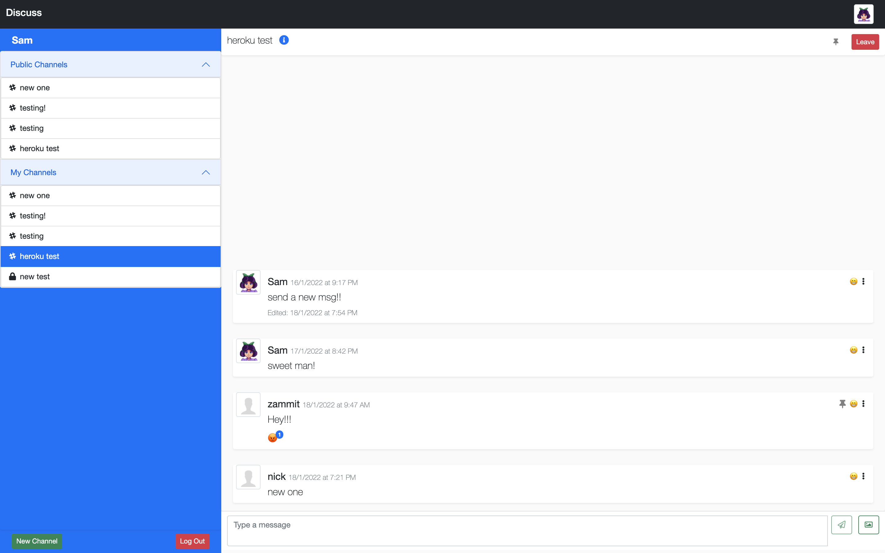
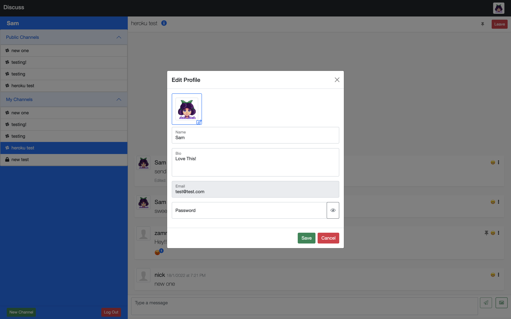
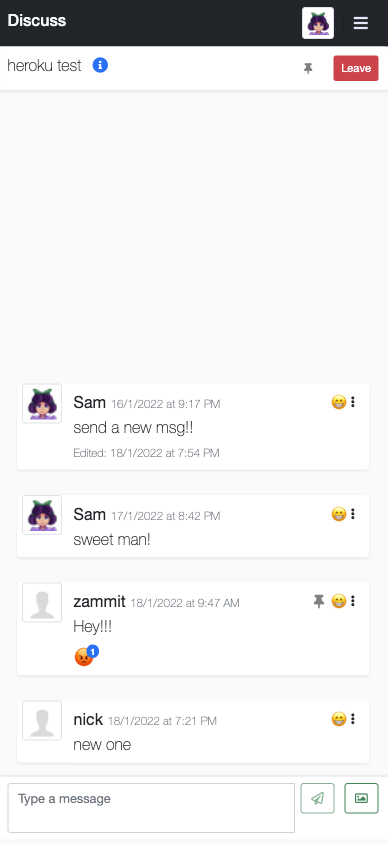
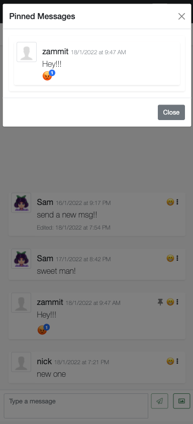
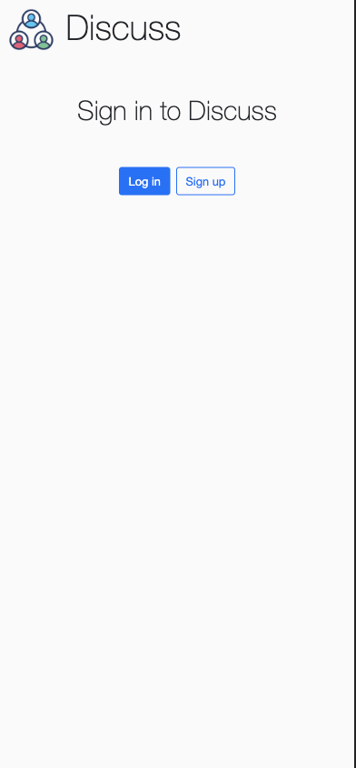

<div align="center" id="top">
  <h1>Discuss Server</h1>
  <a href="https://discussapp.netlify.app/">Click here for demo</a>
</div>
  &#xa0;

<p align="center">
  <a href="#dart-about">About</a> &#xa0; | &#xa0;
  <a href="#sparkles-features">Features</a> &#xa0; | &#xa0;
  <a href="#rocket-technologies">Technologies</a> &#xa0; | &#xa0;
  <a href="#white_check_mark-requirements">Requirements</a> &#xa0; | &#xa0;
  <a href="#checkered_flag-starting-out">Starting Out</a> &#xa0; | &#xa0;
  <a href="#camera-screenshots">Screenshots</a> &#xa0; | &#xa0;
  <a href="#memo-license">License</a> &#xa0; | &#xa0;
  <a href="https://github.com/nicolunardi" target="_blank">Author</a>
</p>

<br>

## :dart: About ##

Discuss is a Slack like app built with a vanilla javacript frontend, bootstrap for styling, and backend of node.js and express.js.

It has most of the functionality of slack, including but not limited to signing up and login, joining and creating private or public channels, inviting members to channels, pinning, reacting to, editing, and deleting messages, as well as sending image messages.

The motivation behind building the project was to understand how javascript really works before moving on to learning a framework like react.

The frontend of the project can be found at [Discuss Client](https://github.com/nicolunardi/Discuss-client)

## :sparkles: Features ##

[:white_check_mark:] Auth functions;\
[:white_check_mark:] sending, editing, and deleting messages in channels;\
[:white_check_mark:] Reacting and pinning messages;\
[:white_check_mark:] Creating public or private channels;\
[:white_check_mark:] Editing channels;\
[:white_check_mark:] Invite members to channels;\
[:white_check_mark:] Invite members to channels;\
[:white_check_mark:] Send image messages;\
[:x:] Search for channels by filters or keywords;\
[:x:] Direct message users;

## :rocket: Technologies ##

The following tools were used in the backend of this project:

- Node.js
- Express.js
- Mongodb
- Mongoose

For the frontend checkout [Discuss Client](https://github.com/nicolunardi/Discuss-client)

## :white_check_mark: Requirements ##

Before starting you need to have Node installed

## :checkered_flag: Starting Out ##

```bash
# Clone this project
$ git clone https://github.com/nicolunardi/Discuss-server

# Install dependencies
$ npm install

# Run the project
$ npm run start

# The server will initialize in the <http://localhost:3000>
```

## :camera: Screenshots ##







## :memo: License ##

This project is under license from MIT

Made with :heart: by <a href="https://github.com/nicolunardi" target="_blank">Nico Lunardi</a>

&#xa0;

<a href="#top">Back to top</a>
